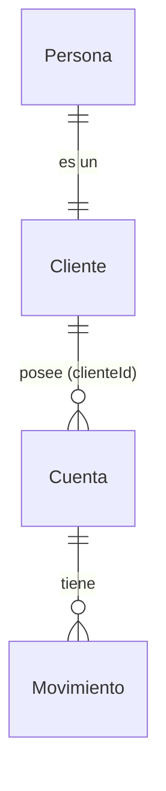

# Modelo de Dominio — Sistema Bancario

Este documento describe las entidades principales del sistema bancario, distribuidas en dos microservicios.

## Convenciones Java

- **Entidades JPA**: Clases anotadas con `@Entity`.
- **IDs**: `Long` autogenerado para entidades. `String` o `UUID` para IDs de negocio si aplica.
- **DTOs**: Java 17 Records.
- **Precios/Dinero**: Siempre usar `BigDecimal`.

---

## Microservicio 1: Personas y Clientes (customer-service)

### Persona
Representa la información básica de un ser humano.
- **id**: Long (PK)
- **identificacion**: String (Unique, ej: Cédula)
- **nombre**: String
- **genero**: String
- **edad**: Integer
- **direccion**: String
- **telefono**: String

### Cliente
Es una `Persona` con credenciales de acceso al banco. Hereda o se relaciona con Persona.
- **clienteId**: Long (Unique, ID de negocio para el banco)
- **contrasena**: String
- **estado**: Boolean (Activo/Inactivo)

---

## Microservicio 2: Cuentas y Movimientos (account-service)

### Cuenta
Representa un producto financiero de un cliente.
- **id**: Long (PK)
- **numeroCuenta**: String (Unique)
- **tipoCuenta**: enum(AHORROS, CORRIENTE)
- **saldoInicial**: BigDecimal
- **estado**: Boolean
- **clienteId**: Long (FK lógica hacia Cliente en customer-service)

### Movimiento
Representa una transacción de dinero en una cuenta.
- **id**: Long (PK)
- **fecha**: LocalDateTime
- **tipoMovimiento**: String (ej: "Retiro", "Deposito")
- **valor**: BigDecimal (Positivo para depósitos, Negativo para retiros)
- **saldo**: BigDecimal (Saldo RESULTANTE después del movimiento)
- **cuentaId**: Long (FK hacia Cuenta)

---

## Relaciones

- Un **Cliente** tiene una **Persona** (Relación 1:1).
- Un **Cliente** puede tener múltiples **Cuentas**.
- Una **Cuenta** tiene múltiples **Movimientos**.

---

## Diagrama de Dominio

## Reglas de Negocio
1. **Validación de Saldo**: Antes de un retiro, `saldoActual + valorMovimiento` no debe ser menor a cero.
2. **Saldo Resultante**: El campo `saldo` en `Movimiento` debe ser igual a `Cuenta.saldoActual` después de aplicar el movimiento.
